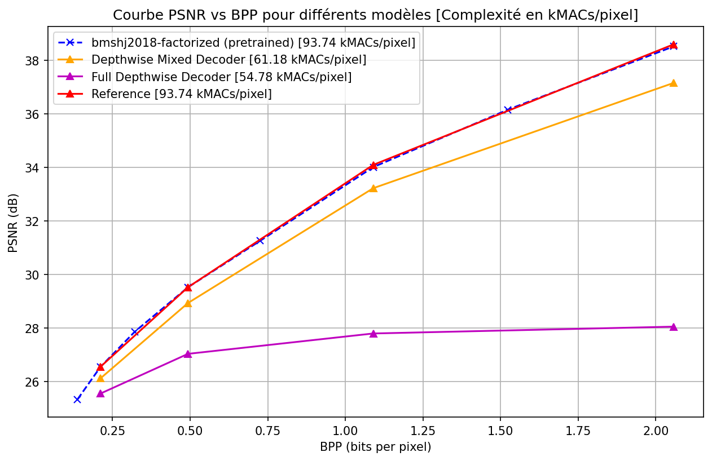

# 🗜️ Optimizing Image Compression Decoders (CompressAI)

This project investigates the impact of using **Depthwise Separable Convolutions** in the decoder of the standard `bmshj2018-factorized` architecture from the [CompressAI](https://interdigitalinc.github.io/CompressAI/) library.

The primary goal is to significantly reduce computational complexity (GFLOPs) and parameter count while maintaining a competitive trade-off between bit-rate (BPP) and reconstruction quality (PSNR).

---

## 📁 Project Structure

The repository is organized as follows:

* `training/`: Python scripts for model training.
  * `train_reference_big.py`: Training the standard decoder (Baseline).
  * `train_mix_v2_big.py`: Training the "Mix V2" decoder (Depthwise + final Pointwise).
  * `train_depthwise_big.py`: Training the "Full Depthwise" decoder.
* `setup/`: Slurm scripts and Conda environment configurations.
* `evaluation/`: Testing and plotting scripts.
  * `plot_compare_final.py`: Computes FLOPs, parameters, and generates Rate-Distortion curves.
  * `rd_curve.png`: The generated results visualization.

---

## 💾 Dataset: COCO 2017

All models were trained on the **COCO (Common Objects in Context)** dataset, chosen for its visual diversity.

* **Official Link:** [COCO Dataset 2017](https://cocodataset.org/#download)
* **Pre-processing:** Images were randomly cropped into 256x256 patches during training.

---

## 🚀 Training Methodology

To ensure a rigorous scientific comparison (ablation study), we followed this protocol:

1. **Frozen Encoder:** The encoder and entropy bottleneck weights are loaded from CompressAI's pre-trained models (Vimeo90k) and frozen (`requires_grad = False`).
2. **Decoder Training:** Only the decoder (either standard or lightweight) was trained from scratch on COCO.
3. **Loss Function:** Optimized using **MSE** (Mean Squared Error).
4. **Quality Levels:** Models were trained for qualities `2`, `4`, `6`, and `8` to cover different latent channel widths ($N=128$ and $N=192$).
5. **Optimization:** Controlled by an Early Stopping mechanism based on learning rate plateaus.

---

## 📊 Results

The use of Depthwise Separable Convolutions allows for a massive reduction in decoder parameters (from ~1.5M to ~280k for high quality) and a significant drop in GFLOPs.

### Rate-Distortion Curve


---

## ⚙️ Setup & Environments

We provide two Conda environments in the `setup/` folder:
* `environment_3090.yml`
* `environment_p100.yml`

⚠️ **Note on Complexity Measurement:**
While both environments are suitable for training, the **`fvcore`** library (used to measure MACs/GFLOPs) is currently only configured in the **P100 environment**. For testing and generating plots, please use the P100 environment.

### Installation
```bash
conda env create -f setup/environment_p100.yml
conda activate compressai_p100
```

### Running a Job
```bash
sbatch setup/run_array_COCO_mix_3090.slurm
```
